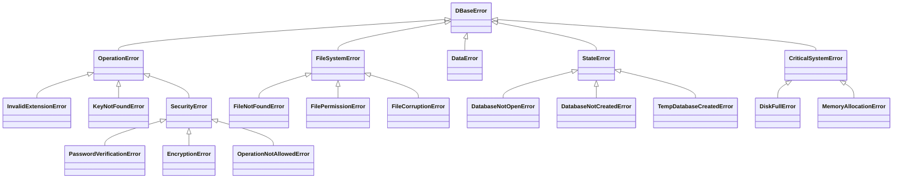

<h1 align="center">🗃️ DBase - Secure Database Library with Encryption</h1>
<div align="center">
    <a href="README.md">English</a>
    <a href="ru/README_ru.md">Русский</a>
    <br><br>
</div>

DBase is a Python library for simplified file management and synchronization with built-in encryption support. It provides an intuitive interface for creating, reading, writing, and deleting databases while maintaining security through Fernet symmetric encryption.

---

## ✨ Features
- **Multiple Database Formats**: Support for `.txt`, `.json`, and encrypted `.dbase` files
- **Military-Grade Encryption**: AES-128 CBC mode via Fernet for sensitive data
- **Comprehensive Error Handling**: 30+ specialized error classes for all scenarios
- **Logging System**: Customizable logger with file rotation and formatting
- **Temporary Databases**: In-memory databases for ephemeral operations
- **Password Protection**: Secure password hashing with SHA-256
- **Atomic Operations**: Safe data modification with automatic backups

---

## ⚙️ Installation
```bash
pip install git+https://github.com/Danex-Exe/dbase.git
```

---

## 🚀 Quick Start
### Basic Text Database
```python
from dbase import DataBase

db = DataBase('data.txt')
db.create()
db.write('Hello World!')
print(db.read())  # Output: Hello World!
db.delete()
```

### JSON Database
```python
db = DataBase('config.json')
db.create()
db.set(key='theme', value='dark')
db.set(data=[('timeout', 30), ('notifications', True)])
print(db.get('theme'))  # Output: dark
db.delete()
```

### Encrypted Database (.dbase)
```python
db = DataBase('secrets.dbase')
db.create(password="MyStrongP@ssw0rd")
db.open()  # Creates secure session

db.set(key='api_key', value='#sensitive_data')  # Auto-hashes values starting with #
print(db.get('api_key'))  # Returns hashed value

db.delete(password="MyStrongP@ssw0rd")
```

---

## 📝 Logger Configuration
```python
db = DataBase('app.log')
db.logger.title = 'APP_LOGGER'
db.logger.log_file = 'application.log'
db.logger.time_format = '%Y-%m-%d %H:%M:%S'
db.logger.format = '[{time}] [{level}] - {message}'
db.logger.log_dir = 'app_logs'
```

---

## 🧪 Testing
Run tests with pytest:
```bash
pytest tests/
```

Test coverage includes:
- Database creation/deletion
- Encryption/decryption workflows
- Error handling scenarios
- Temporary database operations
- Cross-format compatibility

---

## 🔮 Future Roadmap
1. **Database Refactor**: 
   - Support for external connections
   - Client-server architecture
   - SQL-like query interface

2. **Enhanced Error Handling**:
   - Contextual error messages
   - Recovery mechanisms
   - Detailed error codes

3. **Logger Improvements**:
   - Asynchronous logging
   - Compression/rotation
   - Cloud integration

4. **Additional Features**:
   - Role-based access control
   - Audit trails
   - Schema validation

---

## ⚠️ Error Hierarchy


---

## 📜 License
Free for non-commercial use - See [LICENSE](../LICENSE) for details. Commercial use requires explicit permission.

---

## 🤝 Contributing
Contributions are welcome! Please follow these steps:
1. Fork the repository
2. Create a feature branch (`git checkout -b feature/AmazingFeature`)
3. Commit your changes (`git commit -m 'Add some AmazingFeature'`)
4. Push to the branch (`git push origin feature/AmazingFeature`)
5. Open a Pull Request

---

## 📧 Contact
**Daniil Alekseev**  
Email: [dan.d.alekseev@gmail.com](mailto:dan.d.alekseev@gmail.com)  
GitHub: [@Danex-Exe](https://github.com/Danex-Exe)
