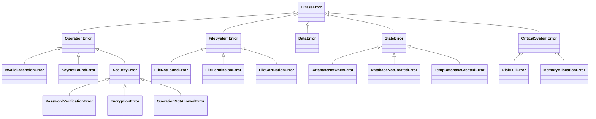

<h1 align="center">🗃️ DBase - Библиотека для безопасной работы с базами данных</h1>
<div align="center">
    <a href="../README.md">English</a>
    <a href="../ru/README_ru.md">Русский</a>
    <br><br>
</div>

DBase - это Python-библиотека для упрощённой работы с файловыми базами данных и синхронизации со встроенной поддержкой шифрования. Она предоставляет интуитивно понятный интерфейс для создания, чтения, записи и удаления баз данных с обеспечением безопасности через симметричное шифрование Fernet.

---

## ✨ Особенности
- **Поддержка форматов**: Работа с файлами `.txt`, `.json` и зашифрованными `.dbase`
- **Военное шифрование**: AES-128 CBC через Fernet для конфиденциальных данных
- **Обработка ошибок**: 30+ специализированных классов ошибок
- **Система логирования**: Настраиваемый логгер с ротацией файлов
- **Временные базы**: Оперативная память для временных операций
- **Защита паролем**: Хеширование SHA-256
- **Атомарные операции**: Безопасное изменение данных с автоматическим резервированием

---

## ⚙️ Установка
```bash
pip install git+https://github.com/Danex-Exe/dbase.git
```

---

## 🚀 Быстрый старт
### Текстовая база данных
```python
from dbase import DataBase

db = DataBase('data.txt')
db.create()
db.write('Привет, мир!')
print(db.read())  # Вывод: Привет, мир!
db.delete()
```

### JSON база данных
```python
db = DataBase('config.json')
db.create()
db.set(key='theme', value='dark')
db.set(data=[('timeout', 30), ('notifications', True)])
print(db.get('theme'))  # Вывод: dark
db.delete()
```

### Зашифрованная база (.dbase)
```python
db = DataBase('secrets.dbase')
db.create(password="MyStrongP@ssw0rd")
db.open()  # Создаем безопасную сессию

db.set(key='api_key', value='#sensitive_data')  # Автоматическое хеширование значений
print(db.get('api_key'))  # Возвращает хешированное значение

db.delete(password="MyStrongP@ssw0rd")
```

---

## 📝 Настройка логгера
```python
db = DataBase('app.log')
db.logger.title = 'APP_LOGGER'
db.logger.log_file = 'application.log'
db.logger.time_format = '%Y-%m-%d %H:%M:%S'
db.logger.format = '[{time}] [{level}] - {message}'
db.logger.log_dir = 'app_logs'
```

---

## 🧪 Тестирование
Запуск тестов:
```bash
pytest tests/
```

Покрытие тестами включает:
- Создание/удаление баз
- Рабочие процессы шифрования
- Обработку ошибок
- Операции с временными базами
- Кросс-форматную совместимость

---

## 🔮 Планы развития
1. **Рефакторинг базы**:
   - Поддержка внешних подключений
   - Клиент-серверная архитектура
   - SQL-подобный интерфейс запросов

2. **Расширенная обработка ошибок**:
   - Контекстные сообщения
   - Механизмы восстановления
   - Детальные коды ошибок

3. **Улучшение логгера**:
   - Асинхронное логирование
   - Сжатие/ротация логов
   - Интеграция с облаком

4. **Дополнительные функции**:
   - Контроль доступа на основе ролей
   - Система аудита
   - Валидация схем данных

---

## ⚠️ Иерархия ошибок


---

## 📜 Лицензия
Бесплатно для некоммерческого использования - подробности в [LICENSE](../../LICENSE). Для коммерческого использования требуется явное разрешение.

---

## 🤝 Участие в проекте
Приветствуются вклады! Порядок действий:
1. Форкните репозиторий
2. Создайте ветку (`git checkout -b feature/AmazingFeature`)
3. Зафиксируйте изменения (`git commit -m 'Add some AmazingFeature'`)
4. Отправьте ветку (`git push origin feature/AmazingFeature`)
5. Создайте Pull Request

---

## 📧 Контакты
**Даниил Алексеев**  
Email: [dan.d.alekseev@gmail.com](mailto:dan.d.alekseev@gmail.com)  
GitHub: [@Danex-Exe](https://github.com/Danex-Exe)
